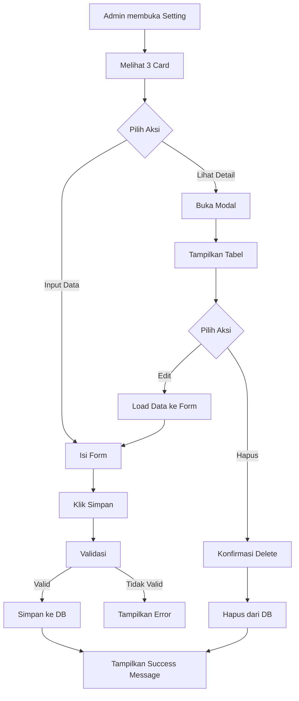

# 📋 Dokumentasi Modul Setting

## 🎯 Overview

Modul Setting adalah fitur pengaturan sistem yang memungkinkan admin untuk mengelola 3 komponen utama:

1. **Divisi** - Mengelola divisi/departemen dalam perusahaan
2. **Asal Sekolah** - Mengelola data sekolah asal siswa PKL
3. **Mentor** - Mengelola data mentor yang terhubung dengan divisi

Setiap komponen memiliki:
- Form input untuk menambah data baru
- Tombol "Lihat Detail" yang membuka modal dengan tabel data
- Fungsi CRUD (Create, Read, Update, Delete) lengkap dalam modal

---

## 🏗️ Struktur Database

### 1. Tabel `divisi_admins`
```sql
id              BIGINT (PK, Auto Increment)
nama_divisi     VARCHAR(255) - Nama divisi
deskripsi       TEXT - Deskripsi divisi
created_at      TIMESTAMP
updated_at      TIMESTAMP
```

### 2. Tabel `sekolahs`
```sql
id              BIGINT (PK, Auto Increment)
nama_sekolah    VARCHAR(255) - Nama sekolah
alamat          TEXT - Alamat sekolah
no_telepon      VARCHAR(255) - Nomor telepon
created_at      TIMESTAMP
updated_at      TIMESTAMP
```

### 3. Tabel `mentors`
```sql
id              BIGINT (PK, Auto Increment)
nama_mentor     VARCHAR(255) - Nama mentor
email           VARCHAR(255) - Email mentor
no_telepon      VARCHAR(255) - Nomor telepon
divisi_id       BIGINT (FK) - Foreign key ke divisi_admins
keahlian        TEXT - Keahlian mentor
created_at      TIMESTAMP
updated_at      TIMESTAMP
```

**Relasi:**
- `mentors.divisi_id` → `divisi_admins.id` (One to Many)
- Ketika divisi dihapus, semua mentor terkait akan otomatis terhapus (CASCADE)

---

## 🚀 Instalasi & Setup

### 1. Jalankan Migration

```bash
php artisan migrate
```

### 2. Jalankan Seeder (Opsional - untuk data dummy)

```bash
php artisan db:seed --class=DivisiAdminSeeder
php artisan db:seed --class=SekolahSeeder
php artisan db:seed --class=MentorSeeder
```

Atau jalankan semua seeder sekaligus:

```bash
php artisan migrate:refresh --seed
```

---

## 💡 Cara Menggunakan

### A. Mengelola Divisi

#### 1. **Menambah Divisi Baru**
- Isi form "Nama Divisi"
- Isi "Deskripsi" (opsional)
- Klik tombol "Simpan Perubahan"
- Data akan tersimpan dan notifikasi sukses akan muncul

#### 2. **Melihat Daftar Divisi**
- Klik tombol "Lihat Detail" di card Divisi
- Modal akan terbuka menampilkan tabel data divisi
- Tabel menampilkan: No, Nama Divisi, Deskripsi, dan Aksi

#### 3. **Mengedit Divisi**
- Buka modal dengan klik "Lihat Detail"
- Klik tombol "Edit" pada baris data yang ingin diubah
- Form di card akan terisi otomatis
- Ubah data yang diinginkan
- Klik "Simpan Perubahan"

#### 4. **Menghapus Divisi**
- Buka modal dengan klik "Lihat Detail"
- Klik tombol "Hapus" pada baris data
- Konfirmasi penghapusan
- ⚠️ **Perhatian**: Menghapus divisi akan menghapus semua mentor yang terkait!

---

### B. Mengelola Asal Sekolah

#### 1. **Menambah Sekolah Baru**
- Isi form "Nama Sekolah" (wajib)
- Isi "Alamat" (opsional)
- Isi "No. Telepon" (opsional)
- Klik "Simpan Perubahan"

#### 2. **Melihat Daftar Sekolah**
- Klik "Lihat Detail" di card Asal Sekolah
- Modal menampilkan tabel: No, Nama Sekolah, Alamat, No. Telepon, Aksi

#### 3. **Mengedit Sekolah**
- Buka modal → Klik "Edit" pada data yang diinginkan
- Form akan terisi otomatis
- Ubah data → Klik "Simpan Perubahan"

#### 4. **Menghapus Sekolah**
- Buka modal → Klik "Hapus"
- Konfirmasi penghapusan

---

### C. Mengelola Mentor

#### 1. **Menambah Mentor Baru**
- Isi "Nama Mentor" (wajib)
- Isi "Email" (opsional, harus format email valid)
- Isi "No. Telepon" (opsional)
- **Pilih "Divisi"** (wajib) - Dropdown akan menampilkan semua divisi
- Isi "Keahlian" (opsional)
- Klik "Simpan Perubahan"

#### 2. **Melihat Daftar Mentor**
- Klik "Lihat Detail" di card Nama Mentor
- Modal menampilkan tabel dengan kolom:
  - No
  - Nama Mentor
  - Email
  - No. Telepon
  - Divisi (badge berwarna)
  - Keahlian
  - Aksi

#### 3. **Mengedit Mentor**
- Buka modal → Klik "Edit"
- Form terisi otomatis termasuk dropdown divisi
- Ubah data → Simpan

#### 4. **Menghapus Mentor**
- Buka modal → Klik "Hapus"
- Konfirmasi penghapusan

---

## 🔧 Komponen Teknis

### Livewire Component

**File**: `app/Livewire/Setting.php`

#### Public Properties

```php
// Form inputs
$nama_divisi, $deskripsi_divisi
$nama_sekolah, $alamat_sekolah, $no_telepon_sekolah
$nama_mentor, $email_mentor, $no_telepon_mentor, $divisi_id_mentor, $keahlian_mentor

// Modal states
$showDivisiModal, $showSekolahModal, $showMentorModal

// Edit mode IDs
$editDivisiId, $editSekolahId, $editMentorId
```

#### Methods

**Divisi:**
- `openDivisiModal()` - Membuka modal divisi
- `closeDivisiModal()` - Menutup modal divisi
- `saveDivisi()` - Menyimpan/update divisi
- `editDivisi($id)` - Load data divisi ke form untuk edit
- `deleteDivisi($id)` - Menghapus divisi

**Sekolah:**
- `openSekolahModal()` - Membuka modal sekolah
- `closeSekolahModal()` - Menutup modal sekolah
- `saveSekolah()` - Menyimpan/update sekolah
- `editSekolah($id)` - Load data sekolah ke form
- `deleteSekolah($id)` - Menghapus sekolah

**Mentor:**
- `openMentorModal()` - Membuka modal mentor
- `closeMentorModal()` - Menutup modal mentor
- `saveMentor()` - Menyimpan/update mentor
- `editMentor($id)` - Load data mentor ke form
- `deleteMentor($id)` - Menghapus mentor

---

## 🎨 UI/UX Features

### 1. **Responsive Design**
- Layout 3 kolom di desktop (md:flex-row)
- Layout 1 kolom di mobile (flex-col)
- Modal responsif dengan lebar maksimal

### 2. **Visual Feedback**
- Hover effects pada card (shadow-md → shadow-lg)
- Success banner setelah operasi berhasil
- Confirmation dialog sebelum delete
- Badge berwarna untuk divisi pada tabel mentor

### 3. **Dark Mode Support**
- Semua komponen support dark mode
- Warna adaptif: `text-neutral-800 dark:text-white`
- Background adaptif: `bg-white dark:bg-neutral-800`

---

## 🔐 Validasi

### Divisi
```php
'nama_divisi' => 'required|string|max:255'
'deskripsi_divisi' => 'nullable|string'
```

### Sekolah
```php
'nama_sekolah' => 'required|string|max:255'
'alamat_sekolah' => 'nullable|string'
'no_telepon_sekolah' => 'nullable|string|max:20'
```

### Mentor
```php
'nama_mentor' => 'required|string|max:255'
'email_mentor' => 'nullable|email|max:255'
'no_telepon_mentor' => 'nullable|string|max:20'
'divisi_id_mentor' => 'required|exists:divisi_admins,id'
'keahlian_mentor' => 'nullable|string'
```

---

## 📊 Query Eloquent

### Mengambil Mentor dengan Divisi
```php
$mentors = Mentor::with('divisi')->latest()->get();

foreach ($mentors as $mentor) {
    echo $mentor->nama_mentor . ' - ' . $mentor->divisi->nama_divisi;
}
```

### Mengambil Divisi dengan Jumlah Mentor
```php
$divisi = DivisiAdmin::withCount('mentors')->get();

foreach ($divisi as $d) {
    echo $d->nama_divisi . ': ' . $d->mentors_count . ' mentors';
}
```

### Mencari Mentor Berdasarkan Divisi
```php
$divisi = DivisiAdmin::find(1);
$mentors = $divisi->mentors; // Collection of mentors
```

---

## 🐛 Troubleshooting

### 1. Error: "Column not found: nama_divisi"
**Solusi:**
```bash
php artisan migrate:refresh
```

### 2. Modal tidak muncul
**Penyebab:** JavaScript/Livewire tidak ter-load
**Solusi:**
- Pastikan `@livewireScripts` ada di layout
- Clear cache browser
- Check console browser untuk error

### 3. Dropdown Divisi kosong di form Mentor
**Penyebab:** Belum ada data divisi
**Solusi:**
```bash
php artisan db:seed --class=DivisiAdminSeeder
```

### 4. Error saat delete divisi: "Cannot delete"
**Penyebab:** Ada mentor yang terkait
**Ini normal:** Sistem akan otomatis delete mentor juga (CASCADE)

### 5. Session flash message tidak muncul
**Solusi:** Refresh halaman atau pastikan ada:
```blade
@if (session()->has('message'))
    <flux:banner variant="success">
        {{ session('message') }}
    </flux:banner>
@endif
```

---

## 🔄 Workflow Umum



---

## 📝 Contoh Kode Penggunaan

### Menambahkan Fitur Filter di Modal

Tambahkan di component:

```php
public $searchDivisi = '';

public function render()
{
    return view('livewire.setting', [
        'divisiList' => DivisiAdmin::where('nama_divisi', 'like', '%' . $this->searchDivisi . '%')
                                   ->latest()
                                   ->get(),
        // ...
    ]);
}
```

Tambahkan di view (dalam modal):

```blade
<flux:input wire:model.live="searchDivisi" placeholder="Cari divisi..." />
```

### Export Data ke Excel

Install package:
```bash
composer require maatwebsite/excel
```

Tambahkan method:
```php
public function exportDivisi()
{
    return Excel::download(new DivisiExport, 'divisi.xlsx');
}
```

---

## 🎯 Best Practices

1. **Selalu isi Divisi terlebih dahulu** sebelum menambah Mentor
2. **Backup database** sebelum delete divisi yang memiliki banyak mentor
3. **Gunakan validasi** untuk memastikan data yang masuk valid
4. **Test di mode Dark** untuk memastikan tampilan konsisten
5. **Bersihkan form** setelah submit dengan `resetForm()`

---

## 🚧 Pengembangan Lanjutan

### Fitur yang Bisa Ditambahkan:

1. **Pagination** - Untuk tabel dengan data banyak
2. **Search & Filter** - Pencarian data dalam modal
3. **Export Excel/PDF** - Export data untuk reporting
4. **Import Excel** - Bulk insert data dari file
5. **Soft Delete** - Data tidak benar-benar dihapus
6. **Audit Log** - Track siapa yang mengubah data
7. **Image Upload** - Foto mentor atau logo sekolah
8. **Status Field** - Aktif/Non-aktif untuk mentor

---

## 📞 Support

Jika menemukan bug atau memiliki pertanyaan:
- Check dokumentasi database: `DATABASE_SCHEMA.md`
- Review file migration di `database/migrations/`
- Check Livewire component di `app/Livewire/Setting.php`

---

**Terakhir diupdate:** 23 Januari 2026  
**Versi:** 1.0.0  
**Dibuat oleh:** Development Team